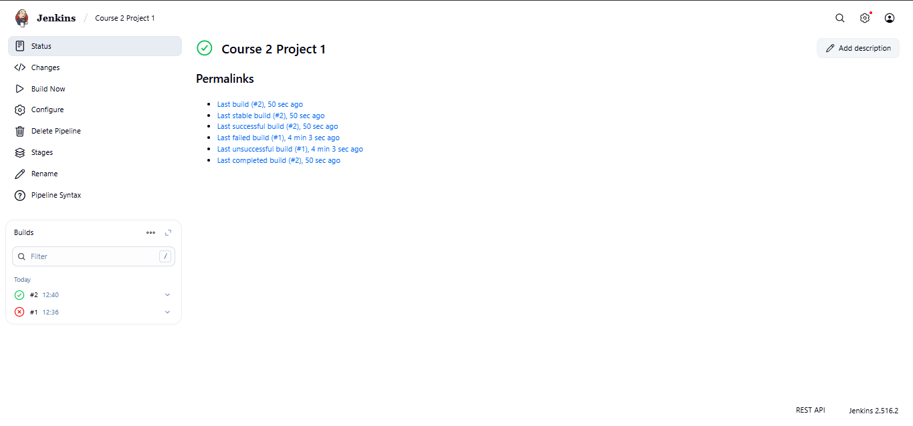
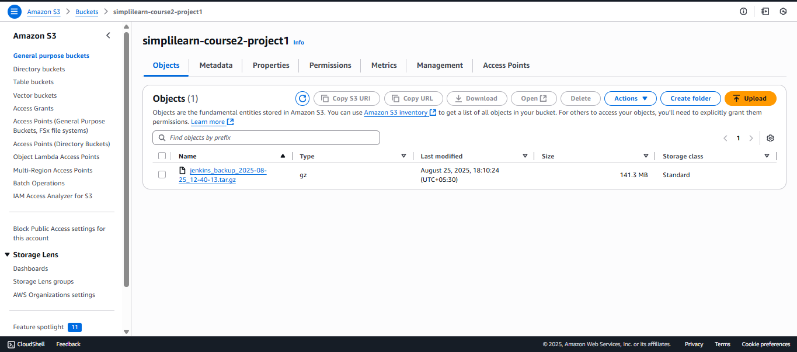

# Automated Jenkins Backup to AWS S3

This project demonstrates a reliable and automated backup and restore solution for Jenkins using AWS S3. It addresses the critical need to prevent data loss from a Jenkins server failure by automating the backup of the Jenkins home directory to a secure S3 bucket.

## 🚀 Project Overview

The core of this project is a Jenkins pipeline that automates the entire backup process. When triggered, the pipeline executes a shell script that performs the following actions:

1. Creates a compressed archive (`.tar.gz`) of the Jenkins home directory (`/var/lib/jenkins`).
2. Uploads this archive to a designated AWS S3 bucket.
3. Cleans up by removing the local archive file from the Jenkins server.

This ensures that all critical Jenkins data, including job configurations and build history, is safely stored and can be restored when needed.

## 🏛️ Architecture & Tools

This solution leverages a standard set of DevOps tools to create a robust CI/CD utility:

* **Jenkins**: The automation server used to run the backup pipeline.
* **AWS EC2**: The virtual server that hosts the Jenkins instance.
* **AWS S3**: Provides secure, durable, and scalable object storage for the Jenkins backups.
* **AWS IAM**: Manages secure access between the EC2 instance and the S3 bucket, using an IAM role instead of hard-coded credentials.
* **Git & GitHub**: Used for version control of the `Jenkinsfile` that defines the backup pipeline.

## ✨ Project Screenshots

Here are the results of a successful pipeline execution.

**1. Jenkins Pipeline Succeeded**  


**2. Backup File in S3 Bucket**  


## 🛠️ How to Deploy (Replicating This Project)

To replicate this project, you will need to set up the infrastructure on AWS and configure Jenkins.

### Prerequisites

1. An active **AWS Account**.
2. An **EC2 Key Pair** created in your target AWS region for SSH access.

### Deployment Steps

1. **Clone the repository:**
    ```bash
    git clone https://github.com/harshraisaxena/jenkins-s3-backup-pipeline.git
    cd jenkins-s3-backup-pipeline
    ```

2. **Set up AWS Resources:**
    * **Create an S3 Bucket:** Go to the AWS S3 console and create a new bucket. Make sure it has a unique name.
    * **Create an IAM Role:** In the IAM console, create a new role for EC2. Attach the `AmazonS3FullAccess` policy to this role. This allows the EC2 instance to perform actions on S3 buckets.
    * **Launch an EC2 Instance:** Launch a new Amazon Linux instance. In the configuration, attach the IAM role you just created. Install Jenkins and Git on this instance.
    * **Configure Security Group:** Ensure the instance's security group allows inbound traffic on port `8080` (for Jenkins) and port `22` (for SSH).

3. **Configure Jenkins Pipeline:**
    * Access your Jenkins server using its public IP address and port 8080 (e.g., `http://<your-ec2-ip>:8080`).
    * Create a new "Pipeline" job.
    * In the pipeline configuration section, select "Pipeline script from SCM".
    * Choose "Git" as the SCM.
    * For the "Repository URL", enter the URL of your forked repository.
    * Ensure the "Branch Specifier" is set to `*/main`.
    * Click "Save".

4. **Run the Backup:**
    * Go to your new Jenkins pipeline job and click "Build Now".
    * The pipeline will run, and you can view the progress in the "Console Output".
    * Once complete, navigate to your S3 bucket in the AWS console. You should see the `jenkins_backup_...tar.gz` file there.

## 🧹 Clean Up

To avoid future charges, remember to delete the resources created for this project:

* Terminate the EC2 instance.
* Delete the S3 bucket (you must empty it first).
* Delete the IAM role.
